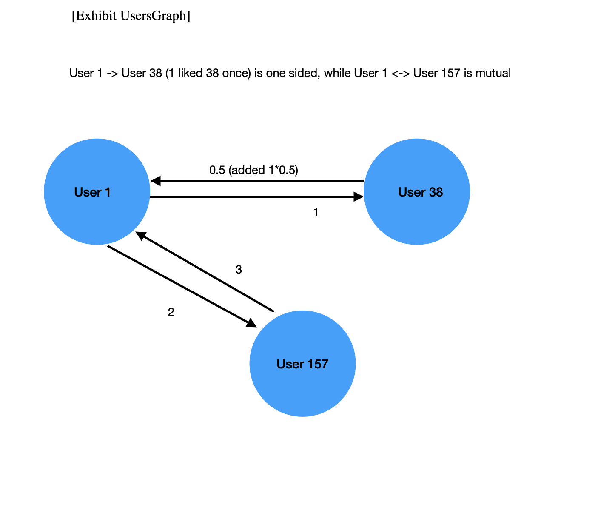

## LyncUp

**LyncUp** is a web app that uses machine learning to intelligently match remote workers into small-group chatrooms. It is designed to reduce social isolation among remote workers and foster meaningful, professional connections. 

This repository contains the Django backend codebase that powers LyncUp.

How it works: when users feel ready to network, they simply join a queue. LyncUp then finds the best possible match from other users currently in the queue, placing them into a chatroom with 2–3 people who are predicted, based on past interactions and preferences, to align well with one another. 

As users continue to participate and privately “Like” those they enjoyed interacting with, the system refines its understanding of their preferences. Over time, this enables increasingly accurate and relevant matches, helping users build deeper, more valuable professional networks.

## Frontend (React) Codebase 
https://github.com/jumanlee/lyncupreact

## Table of Contents

- [Software Architecture Overview](#software-architecture-overview)
- [Database Design](#database-design)
- [Features Overview](#features-overview)
- [Features Implementation](#features-implementation)
- [Matching Algorithm Implementation](#matching-algorithm-implementation)
- [Software Testing](#software-testing)
- [Matching Algorithm Performance Evaluation](#matching-algorithm-performance-evaluation)
- [LyncUp's Viability](#lyncups-viability)
- [Possible Future Development](#possible-future-development)
- [References](#references)


## Software Architecture Overview


As shown in the architecture diagram, LyncUp’s software architecture uses
Django as the backend, React as the frontend, Redis with Django Channels to handle real-time features such as queuing and chatroom functionalities. Django Rest Framework (DRF)
is used to provide endpoints for user registration, login, recording “Like” data and
friendship management. User information is stored in a PostgresSQL database and is
accessed via Django’s Object Relational Model (ORM). 

On the frontend side, React
manages the user interface by displaying the appropriate interfaces for queuing, liking users
and chatrooms once users are matched. Users who enter the “Queue” are placed in Redis by
the QueueConsumer, which listens for WebSocket connections and tracks who is waiting in
the queue. 

As scheduled by Celery Beat, Celery Workers run the matching algorithm by first
retrieving the list of waiting users from Redis. The matching algorithm then uses an **Approximate Nearest Neighbour** (ANN)
index file generated by another ANN-generating algorithm with the use of Node2Vec
embeddings of user “Like” data. Specifically, all users are nodes and all “Like” interactions
are considered directed edges in a graph and Node2Vec learns an embedding that captures
each user’s similarity to others based on their interactions.

The ANN file allows the matching process to efficiently look up the top-k nearest
neighbours for each waiting user. The system also enables multiple queue “clusters”,
however, currently I only use a single cluster called “global” and a fallback “leftover”
queue for random matching if required. This is because I currently do not have enough
users in the system to support multi-cluster matching. Doing so would affect the matching
quality.

Once the matching algorithm successfully identifies groups of three or four users, it assigns
each group a unique room ID. The room IDs are then broadcast via WebSocket back to
each user’s React app, which prompts the frontend to close the existing queue WebSocket,
then opens a new WebSocket to the assigned chatroom and then navigates the users to their
respective chatrooms.
The real-time chatroom functionality is managed by GroupConsumer. 

The process from queuing to real-time matching to chatroom redirection all depends on the choreography
between Django Channels (WebSockets management), Redis (for both queue storage and
channel layers), Celery (to schedule and perform the matching tasks) and the Node2Vec-based representations that enables the matching algorithm.

## Database Design


(See: https://github.com/jumanlee/lyncupdjango/blob/master/users/models.py)

The AppUser model has a many-to-one relationship with the Organisation model, meaning
many users can belong to one organisation. It also has a one-to-one relationship with the
Profile model, where each user has exactly one profile and vice versa. The Like model acts
as a bridging table to create a self-referential many-to-many relationship between AppUser
instances. This means that each Like record links one user (user_from) to another (user_to)
using two many-to-one foreign keys pointing to AppUser. This allows a user to like many
others and be liked by many others, with additional fields like like_count and last_like_date
stored in the Like model.

## Features Overview

Queue button UI:


Chatroom UI:


The user can update their individual profile, which is shown in a popup when their name is clicked on:


To use LyncUp, users log in to the web app and enters a queue, while a match is being searched. Once a match is found, the users are redirected to a chatroom. The image above shows the chatroom interface of LyncUp. As an overview, LyncUp automatically aims to  match users who are likely to like each other, and place them into chatrooms. This allows users to socialise, with each chatroom hosting three or four users. The rationale behind a maximum of four users in each chatroom is that I aim to balance between social comfort and variety. 

Next to each user, there is a “Like” button which allows the main user to click to indicate a positive impression. This “Like” data is then used for improving the system’s future matches. 

The matching of users depends on how the backend logic computes user similarity. In this project I have chosen user-user collaborative filtering (CF) methodology which is typically used in recommendation systems such as movie recommendations or Instagram “you may know this person” feature. In many CF systems, users rate items such as movies or products on a scale of 1 to 5. 

LyncUp’s approach to this is for the users themselves to become both the “raters” and the “items”. This allows the matching algorithm to capture each user’s preferences in the form of a “Like” system, where pressing a “thumbs-up” button on a user in a chatroom indicates positive impression.  For example, if user A and user B both liked the same group of users, then user A and B are deemed to be more similar and are thus more likely to like interacting with each other. This approach is inspired by real life in a sense that, if two people know the same group of people, then they may have something in common.

It is important to point out that LyncUp’s approach does not simply re-match two users if one has “Liked” the other in the past. Instead, the system looks for overlaps in the group of people that each user has “Liked”. In other words, if user A and user B both repeatedly “Like” the same collection of other users, LyncUp infers a shared set of preferences or interests between A and B. As a result, the matching algorithm considers them more likely to enjoy interacting with each other, even if they have never directly “Liked” one another before. 

This pattern-based similarity measure aims to increase the chance of discovering new but compatible social connections, rather than simply re-match users based on one-sided or mutual likes alone. Crucially, this also prevents the system from matching two people again and again just because they have both “Liked” each other in the past. 

LyncUp uses a user-user content filtering methodology that relies on “Likes” data, rather than the traditional star ratings. Instead of rating items from 1 to 5, they select a binary thumbs-up or nothing at all.

Technically speaking, LyncUp’s challenge is how computationally feasible this approach is. I initially considered the K-nearest neighbour algorithm to find out the top-k most similar users based on historical “Like” data to match users. However, as the user count grows, so does the computation time, rendering it unfeasible. This is the reason why the Approximate Nearest Neighbour (ANN) technique is chosen. Essentially, the ANN technique sacrifices a bit of accuracy for more efficiency in finding top-k similarities. Due to the large scale of possible users, in this project, I use the Annoy, which is an ANN library provided by Spotify.

LyncUp converts its “Like” data, which are user interaction data collected from each chat session and stored in the PostgresSQL database, into a graph, using Node2Vec, a graph-embedding algorithm. [23][24]. This graph is then converted to a fixed-vector representation, which is then used as an input for ANN indexing. This process generates an ANN file, which enables the system to find the top-k most similar users for matching.

## Features Implementation

Users enter a queue and are dynamically matched before being automatically directed to a chatroom where they can engage in discussions. A key feature of the platform is the “Like” system, which allows users to indicate positive interactions with another user by pressing a thumbs-up button. These interactions are recorded and used to improve future matches, ensuring that users are more likely to be paired with other users that they have previously liked. Over time, this system learns to make better matches as increasing “Like” data become available. 

### Django Models Overview
(See: https://github.com/jumanlee/lyncupdjango/blob/master/users/models.py)

The AppUser model is a custom user model that replaces Django’s default authentication system, allowing email-based login and optional affiliation with an Organisation. The Profile model adds to an AppUser’s core data by storing additional details such as age, personal description and affiliated organisation while keeping authentication information separate. This structure makes user management more secure and flexible.

Crucially, the Like model records positive user-to-user interactions. Whenever one user “Likes” another user, the platform creates or updates a row that tracks their like_count. The interaction data stored in the Like model is what the matching algorithm uses to generate the Annoy index file, which is then used to efficiently identify and match similar users.

The Organisation model represents companies that users can be affiliated with. These values are predefined by admins so that users can be accurately grouped under their respective organisations. This ensures consistent data entry, prevents duplicate or misspelled organisation names. Each AppUser can be linked to an Organisation through a foreign key, allowing grouping of users. The Organisation relationship is indirectly reflected in the user’s Profile as well, since each Profile is linked one-to-one with an AppUser, making it easy to obtain both organisational and personal information for each user.

### LyncUp Workflow
Next, I outline the workflow from the user’s initial interaction with the app. When a user accesses LyncUp, they are first presented with a login page. Upon successful authentication, they are directed to the main interface, where a "Queue" button is displayed.


(See: https://github.com/jumanlee/lyncupdjango/blob/master/matching/consumers.py)

When the user presses the “Queue” button, the React app sends a request to the Django app’s consumer to establish a WebSocket connection while they wait. In the Django app, users who initiate a queue WebSocket connection are recorded in Redis. Approximately every 15 seconds, as scheduled by Celery Beat, the matching algorithm retrieves the list of users currently in the queue from Redis and attempts to find suitable matches among them. The process ensures that users are dynamically grouped as soon as a match is available. The implementation of the Queue Consumer, responsible for handling WebSocket connections related to the queue, is detailed in the GitHub link above.

(See: https://github.com/jumanlee/lyncupdjango/blob/master/matching/tasks.py)

The matching algorithm is executed periodically (e.g. 15 seconds scheduled by Celery Beats), as shown in the link above, by Celery workers in tasks.py.

Once groups of three to four users are successfully matched, the matching algorithm outputs the result in the following format:

```python
matched_groups = [{"room_id": 123, "user_ids": [1,2,3,4]}, {"room_id": 555, "user_ids": [5,6,7,8]}, …..]
```

(See: https://github.com/jumanlee/lyncupdjango/blob/master/chat/consumers.py)

Each room ID from matched_groups is then sent to the respective users who are waiting in the queue. Upon receiving the room ID, the React app of each matched user initiates a new WebSocket connection to join the assigned chatroom. For example, if users A, B, and C are matched, each of their React apps receives the same room ID and uses it to establish a WebSocket connection for the chatroom. Once the WebSocket connection to the chatroom is established in Django, the users are automatically redirected to the same chat interface, allowing them to start their conversation. The opening of new WebSocket connection for a chatroom is handled by the GroupConsumer(chatroom) shown in the above link.

On the React side, the matched users are dynamically directed to their respective chat interface:


## Matching Algorithm Implementation

Now that I have outlined the overall workflow, from users entering the queue to being matched and redirected to their assigned chat interfaces, I can now examine the most critical component of the software: the matching algorithm.

As shown above, this is executed in tasks.py periodically.

The algorithm is made up of four components, I will go through them individually:

### Component 1: Build graph from likes 

(See: https://github.com/jumanlee/lyncupdjango/blob/master/matching/build_graph_annoy.py)

This component takes in a dataset of user interactions from the Like model and uses it to generate an Annoy index file and a global_map.json file. The Annoy index file is used to efficiently search for users with similar interaction patterns based on their “like” behaviour. Annoy indexing is a more efficient adaptation of the K-nearest neighbour algorithm. 

For context, here is an example of a dataset from the Like model:


First, the create_graph_from_likes(likes_df, reciprocal_weight=0.5) function uses the data queried from the Like model and builds a directed graph where each node represents a user and edges represent “Like” interactions. If user 1 has liked user 38, an edge is created from user 1 to user 38, with weight representing the number of likes. If there is no reciprocal like from 38 to 1, a weaker reverse edge is added with a reduced weight (e.g. *0.5). This ensures that one-sided likes have a weaker influence compared to mutual interactions. 

For context, I initially considered building a sparse matrix from the Like interaction dataset instead of this graph-based approach. However, because Annoy requires a dense matrix as an input, this would involve constructing an NxN matrix, where each row and column represents a user and the values indicate the strength of “Like” interactions between then, for example: 

```python
dense_like_data = [
	[0, 5, 10, 0,…] #for user 0 (user 1: 5 likes, user 2: 10 likes)
	[3, 0, 0, 8,…]
	[3, 0, 0, 8, 0,…]
	[3, 0, 0, 8, 0,…]…]
```

For a dataset with 1 million users, this would require storage and computation of 1 million x 1 million matrix, which would not be feasible. Hence the graph approach is chosen, instead. User interactions would instead be represented as follows:



(See: https://github.com/jumanlee/lyncupdjango/blob/master/matching/build_graph_annoy.py)

The graph-creating function is used within create_node2vec_annoy(). The main advantage of using a graph representation is that it allows us to generate graph embeddings, which are fixed-dimensional vector representations of nodes that capture the relationships in the graph. Using the Node2Vec library, I convert the graph into embeddings by simulating random walks. As I have a fixed number of dimensions with graph embeddings, this makes processing the “Like” interactions significantly cheaper computationally and memory-wise, compared to using a NxN dense matrix. 

***In the graph embedding space, if, for example, user A and user B liked a similar set of users, their embeddings will be closer together in the vector space since they share similar interaction patterns. This represents the user-user content filtering section of the algorithm and sets the groundwork for constructing the Annoy index.***

(Image from: https://www.youtube.com/watch?v=oDsbCoP_9Ac&t=248s)


In our implementation, the Node2Vec library algorithm [23][24] learns the structural relationship between all nodes and represents them in a fixed-dimensional embedding space. It does this by running random walks on the graph and training a skip-gram model to capture the similarities between the nodes. I set the p and q parameters to 1.0, which results in an unbiased random walk (effectively DeepWalk). This means that the algorithm does not favour either a breath-first or depth-first search, making it unbiased when exploring the node relationships. However, these parameters can be altered later if the evaluation results indicate that a different walk strategy would represent better. I use 128 dimensions for create_node2vec_annoy(). 

create_node2vec_annoy() then outputs an Annoy file, which allows the matching algorithm to efficiently retrieve the top-k most similar users based on their like interactions. Instead of using direct user IDs, Annoy operates on integer-based indices, this means I need the global_map.json file (another output file), which stores the a dictionary for looking up Annoy user indices with user IDs.  

(See: https://github.com/jumanlee/lyncupdjango/blob/master/matching/tasks.py)

As this function is still computationally expensive, it is executed periodically by Celery workers (e.g. every 24 hours), as scheduled by Celery Beats. The likes_df comes from the Like model.

### Component 2: Queue Manager

(See: https://github.com/jumanlee/lyncupdjango/blob/master/matching/queue_manager.py)

To process users waiting in the queue with the matching algorithm, I use the queue manager.

ClusterQueueManager supports multiple clusters to accommodate potential future use cases where users may be segmented into different groups for more separated matchings, for example, grouping by country, interests or industries, to ensure they are matched with others within the same category. However, at this stage, segmentation would weaken matching quality due to low user numbers. Hence, for now, all users are placed in a single “global” cluster. The leftover cluster acts as a fallback for users who cannot be matched with the “global” Annoy index. These users are matched randomly instead in the leftover cluster.

### Component 3: Matching

(See: https://github.com/jumanlee/lyncupdjango/blob/master/matching/matching.py)

Once the Annoy index file and queue manager are in place, I can start matching the users. I first match users in each individual cluster. However, in this case, as mentioned, it will just involve the “global” cluster, and then “leftover” cluster. I first look at match_in_cluster, which takes in the queue_manager, which is used to collect all users waiting in the Redis queue to be matched, as a parameter. The individual cluster needs to be specified (e.g. “global” or “leftover”). 

match_in_cluster() is then used in run_batch_matching() to match each cluster individually (see below code). In our case for now, as mentioned, these clusters will be “global” and “leftover”. run_batch_matching will then output a Python Dict showing which users in each cluster have been grouped together in three or four. 
For example: 
```python
{“global”: [[1,2,3,4], [5,6,7,8]], “leftover”: [[9,10,11], [12,13,14,15]]}. 
```

Each group, e.g. [1,2,3,4], will be placed in their respective allocated chatrooms later.

### Component 4: Distribute Chatrooms

(See: https://github.com/jumanlee/lyncupdjango/blob/master/matching/distribute_rooms.py)

Now that I have in place run_batch_matching(), which outputs, for example: 
```python
{“global”: [[1,2,3,4], [5,6,7,8]], “leftover”: [[9,10,11], [12,13,14,15]]}
```
I need to assign a chatroom for each group. This is handled by distribute_rooms(). 

The distribute_rooms() function takes in grouped_users as a parameter, which is the output of run_batch_matching(). It also requires the Redis client to track which room IDs are currently in use, so that only available room IDs are assigned. This prevents assigning duplicate room IDs to different groups.

The function then outputs a tuple containing matched_groups and users_in_matched_groups. Each room_id is assigned randomly. An example of matched_groups is: 
```python
{“room_id”: 115, “user_ids”: [1,2,3,4], “room_id”: 222, “user_ids”: [5,6,7,8]}
```

Once rooms are assigned, Celery workers pass each user's assigned room_id through Django Channels, sending it through their respective WebSocket connections. After receiving the room ID, each user's React client will close its queue WebSocket, then open a new WebSocket for the assigned chatroom and redirect the user to the chat interface.

users_in_matched_groups stores all users who will be sent the room ID.

## Software Testing

In this section, I will focus on unit and integration testing, using the PyTest library, as well as the model performance metric and the overall viability evaluation.

### Unit Testing

#### Evaluate Component 1: Build graph from likes evaluation

(See: https://github.com/jumanlee/lyncupdjango/blob/master/tests/unit_tests/test_create_graph_annoy.py)

The set of tests for create_graph_annoy is stored in test_create_graph_annoy.py, within
the file there are two test functions: test_create_graph_from_likes() and test_create_node2vec_annoy().

Here, I am testing with a small dummy dataset to see when the function converts the Like
dataset into a graph, does the graph contain the correct values and structure. I also test if create_node2vec_annoy() can create the correct file types with the expected keys and structure in the correct folder.

#### Evaluate Component 2: Queue Manager:

(See: https://github.com/jumanlee/lyncupdjango/blob/master/tests/unit_tests/test_queue_manager.py)

In test_queue_manager.py, I have tested each of the ClusterQueueManager’s functionalities.

#### Evaluate Component 3 and 4 and the full run of the matching algorithm with small and full-scale data:

(See: https://github.com/jumanlee/lyncupdjango/blob/master/tests/unit_tests/test_run_full_matching_algo.py)

In test_run_full_matching_algo.py, I test the entire matching algorithm pipeline, using
both a small dummy dataset and a large-scale dataset containing 1 million interactions
among 10,000 simulated users. This allows us to evaluate the algorithm under normal
conditions as well as perform stress testing to assess its performance under heavy load.
Since this is unit testing, I use a mock Redis client instead of the actual Redis instance.
The real Redis client will be tested separately during integration testing. Once the mock Redis is in place, I proceeded to testing match_in_cluster. Once it is certain that match_in_cluster works as expected, I proceeded to testing the full run_batch_matching() with a full-scale data of 1 million interactions along with the assumption that there are 3,000 users in the queue, waiting to be matched. This involves running create_node2vec_annoy(), queue_manager, match_in_cluster() during the cycle. A test of this size would typically take minutes to complete. This is due to the Node2Vec algorithm learning the structure of the sizeable graph and converting it into a fixed-dimensional vector.

Next, I test if distribute_rooms can take the output of run_batch_matching() and return the
correct data structure with each group of three or four. I first test distribute_rooms() with a
small mock dataset in test_distribute_rooms_with_mock_and_small_data().

Next, I proceeded to testing distribute_rooms() with a large-scale data, which assumes
there are 3,000 users waiting in the queue, making use of the Annoy file I previously
created in test_run_batch_matching_with_big_data(), which uses the dataset with 1 million.

This test is implemented in test_distribute_rooms_with_mock_and_big_data() checks every
group formed for correctness.

### Integration Testing

The next phase of testing is integration testing. While unit testing focuses on checking the
functionality of individual components of the matching algorithm, integration testing
ensures that all system components work together as expected. This involves testing the
actual implementation of Django Channels, Redis, Celery, and other backend services for
correctness.

#### GroupConsumer testing

(See: https://github.com/jumanlee/lyncupdjango/blob/master/tests/integration_tests/test_group_consumers.py)

This test is implemented in test_group_consumers.py. In this test, I verify if
GroupConsumer can support the the messaging between the three or four members in the
chatroom correctly. The first test is to check whether GroupConsumer properly handles JWT
authentication, ensuring that a connection can only be made with a valid token and is
rejected if the token is invalid.

Next, I test if a user can send and receive messages in a chatroom, then, I check if there are multiple users in the chatroom, and whether GroupConsumer can handle their communication.

#### QueueConsumer testing

(See https://github.com/jumanlee/lyncupdjango/blob/master/tests/integration_tests/test_queue_consumer.py)

The QueueConsumer tests are implemented in test_queue_consumer.py. At this stage, I
have tested whether a user can successfully establish a queue WebSocket connection with
QueueConsumer when properly authenticated and added to the queue.

### Unit and Integration Testing Results

PyTest was run with all tests (unit tests and integration tests) passing successfully.


## Matching Algorithm Performance Evaluation

(See: https://github.com/jumanlee/lyncupdjango/blob/master/tests/matching_algo_eval/matching_algo_eval.ipynb)

I cannot directly evaluate our user-likes-user matching algorithm within LyncUp because LyncUp currently has no real user data. Instead, I use a public dataset of anime ratings [25] as a proxy to test whether our matching logic can yield real user similarity. In this dataset, any rating of 5 or more (out of 10) is treated as a “Like.”  I construct a bipartite graph where each user node connects to the movies they like with an edge weight of 1.0. Movies point back to users with a reverse edge weight of 0.5. This mirrors LyncUp’s planned graph structure, where a user liking another user would be the forward edge and a reverse edge would represent one-way interest. I then apply the exact same Node2Vec hyper-parameters and methodology that I use in LyncUp to learn user embeddings, which are used for the Annoy file which gives us three nearest most similar neighbour users.

To evaluate how well the three nearest neighbours represent a user similarity, I conduct a Precision@1 test. First, I split each user's liked movies (those rated 5 or higher) into a training and a test set. I use only the training data to compute user embeddings with Node2Vec and find the three most similar neighbours for each user using Annoy. For each user, I then collect all the movies liked by those three neighbours and rank them by how many neighbours liked each one. I recommend the top-ranked movie to the user and then check if that movie appears in the user’s held-out test set. If it does, I count it as a correct prediction. This only happens if at least one neighbour also liked that same movie, because our recommendation pool is made up entirely from what the neighbours individually liked.

After running this across all users, I find a Precision@1 of around 27%. This means that in 27% of cases, the user and at least one neighbour share a common liked movie.

Although I am working with “user-likes-movie” rather than “user-likes-user,” the logic is nearly the same. In LyncUp, each edge will represent one user liking another user and finding the top three neighbours for a given user is similar to identifying three users who share many of the same “liked people.” This means that in the anime dataset proxy testing, a correct Precision@1 means the user and at least one neighbour liked the same recommended movie. 

In LyncUp, this directly translates to the user and at least one matched user in the chatroom have previously liked another same person in other chat sessions (similar to having a mutual friend). So 27% Precision@1 infers that 27% of chatrooms are likely to contain at least one real shared like. I can therefore infer that when a user is placed into a chat session with three other people, there is a 27% chance that at least one of those three has previously liked the same person the user liked in a past session.

## LyncUp's Viability

Let’s work out the probability to illustrate LyncUp’s viability. I define:

**P(shared like)** = probability that the user shares at least one mutual liked person with someone in the chatroom.

Inferring from the proxy test result of Precision@K:
**P(shared like in 1 session) = 0.27**

Then:

**P(no_shared_like in 1 session) = 1 - 0.27 = 0.73**
**P(no_shared_like in 2 sessions) = 0.73 × 0.73 = 0.5329**

Therefore: 

**P(at least one shared_like in 2 sessions) = 1 - 0.5329 = 0.4671**

This means that after two independent chat sessions, there is already a 46.71% chance that the user will have encountered at least one person who liked someone they also previously liked, representing similarity.

This probability continues to increase with each new chat session. As time goes on and the user participates in more sessions, this probability compounds further. Over many chat sessions, these accumulate, increasing the chances that users will form meaningful connections. This could lead to users engaging in deeper conversations and even prompting a follow on each other on LinkedIn or continuing the relationship elsewhere. Since users can just repeatedly queue and match on LyncUp with no cost, this cumulative matching effect is a key strength of our algorithm and highlights how even a single shared liking history can act as social glue when repeated across sessions, proving the viability of LyncUp.

### Independence assumption 

The geometric compounding above treats each chat session as an independent Bernoulli trial. That approximation only holds if:

1. The queue population is large relative to the room size
2. The matching avoids re-matching the same pair of users in consecutive sessions. 

I am keeping the compounded figure purely as an intuition pump, it is not a hard guarantee.

## Possible Future Development

### Improving the matching algorithm's performance

As soon as LyncUp has a large enough real-user base, the 27 % proxy figure can be replaced with live measurements. Those data will let us fine tune the Node2Vec hyperparameters, adjust Annoy index settings, and, if needed, swap in better techniques to improve the matching algorithm's precision rate. Even modest gains in the precision rate will compound across successive matches, making the overall user-experience lift disproportionately large.

### Video call integration

LyncUp’s current chat feature is text-based only. However, adding optional video or audio calls could further enhance user experience. Enabling video chat, however, introduces higher bandwidth and lower latency requirements, which require careful load balancing and possibly even media server clusters to handle peak usage smoothly.

### Expanded user profile

LyncUp deliberately avoids forcing users to input detailed personal data, relying solely on “Liked” interactions for matchings. However, it could offer more optional fields to refine matches in a more subtle way. For instance, letting users optionally share attributes like time zone, industry, occupation might help to filter out truly incompatible matchings. This extra context could be used to match chat session when everyone is actually available or to unite users around at least some shared attributes while preserving both match diversity. 

### Transitioning from CPU-based to GPU-Accelerated Node2Vec

Currently, Node2Vec runs on CPU. If user numbers surge into the millions, generating or updating graph embeddings on CPU alone may become a problem. One solution is to migrate to GPU-accelerated libraries like cuGraph (part of NVDIA’s RAPIDS AI suite), which parallelises graph traversal and embedding computation. This upgrade could reduce training times substantially and keep the matching algorithm functioning under heavy loads. 

### Potential use of AI-powered matching

Although LyncUp’s existing approach already produces some results based on proxy testing, deeper AI-powdered methods could capture more hidden behavioural patterns. For example, advanced neural-based CF or large language models could detect more subtle user similarities. However, such implementations could mean higher computational costs.

### Final Thoughts

By pursuing these possible developments, LyncUp can evolve into an even more robust platform. Its current design successfully demonstrates that small group matchings, enabled by its matching algorithm, can produce non-trivial results based on our evaluation. With the continued improvements discussed, LyncUp can grow with its user base to deliver consistent and meaningful social experiences in the modern virtual workplace. 

## References

(1) Bollestad, V., Amland, J.S. and Olsen, E. (2022) ‘The pros and cons of remote work in relation
to bullying, loneliness and work engagement: A representative study among Norwegian workers
during COVID-19’, Frontiers in Psychology, 13. Available at: https://doi.org/10.3389/fpsyg.2022.1016368 (Accessed: 15 December 2024).

(2) Bryan, B.T., Andrews, G., Thompson, K.N., Qualter, P., Matthews, T. and Arseneault, L. (2023)
‘Loneliness in the workplace: A mixed-method systematic review and meta-analysis’, Occupational
Medicine, 73(9), pp. 557–567. Available at: https://doi.org/10.1093/occmed/kqad138 (Accessed: 15
December 2024).

(3) Buffer (2023) State of Remote Work 2023. Available at: https://buffer.com/state-of-remote-work
(Accessed: 15 December 2024).

(4) Lane, J.N., Ganguli, I., Gaule, P., Guinan, E., and Lakhani, K.R. (2020). ‘Engineering serendipity: When does knowledge sharing lead to knowledge production?’ Strategic Management Journal, 42(6), 1215–1244. Available at: https://doi.org/10.1002/smj.3256 (Accessed: 15 December 2024).

(5) Yang, L., Holtz, D., Jaffe, S., Suri, S., Sinha, S., Weston, J., Joyce, C., Shah, N., Sherman, K.,
Hecht, B. and Teevan, J. (2021) ‘The effects of remote work on collaboration among information
workers’, Nature Human Behaviour. Available at: https://www.nature.com/articles/s41562-021-01196-4 (Accessed: 15 December 2024).

(6) Dyvik, E.H. (2024) Loneliness among employees working from home worldwide 2023. Statista.
Available at: https://www.statista.com/statistics/1476817/global-employee-lineliness-wfh/
(Accessed: 15 December 2024).

(7) University of Oxford (2019) Happy workers are 13% more productive. Available at: https://www.ox.ac.uk/news/2019-10-24-happy-workers-are-13-more-productive (Accessed: 15 December
2024).

(8) Andersen, L.M.B., Reavley, N.J., Bøggild, H. and Overgaard, C. (2020) ‘How, for whom and
under what circumstances do web-based platforms work to promote belonging and mental health? A
realist evaluation of a web-based citizen-to-citizen platform’, Health & Social Care in theCommunity, 29(2), pp. 548–560. Available at: https://onlinelibrary.wiley.com/doi/10.1111/hsc.13222
(Accessed: 15 December 2024).

(9) Ang, C.S. (2020) ‘Attitude toward online relationship formation and psychological need
satisfaction: The moderating role of loneliness’, Psychological Reports, 123(5), pp. 1887–1903.
Available at: https://doi.org/10.1177/0033294119877820 (Accessed: 15 December 2024).

(10) Liu, L. (2024) ‘Research on the relationship between virtual social interaction and the degree
of loneliness based on algorithm matching technologies: A quantitative analysis on the SOUL APP-
A virtual social software for strangers’, Plos One. Available at: https://doi.org/10.1371/journal.pone.0312522 (Accessed: 15 December 2024).

(11) Swerbenski, K.L., Barnett, K.C., Devine, P.G. and Shutts, K. (2023) ‘Making “fast friends”
online in middle childhood and early adolescence’, Social Development, 32(4), pp. 903–919. Available at: https://doi.org/10.1111/sode.12708 (Accessed: 15 December 2024).

(12) Mesch, G.S. and Talmud, I. (2006) ‘Friendship formation, communication channels, and social
closeness’, Social Networks, 28(1), pp. 1–25. Available at: https://www.semanticscholar.org/paper/Friendship-Formation-%2C-Communication-Channels-%2C-and-Mesch-Talmud/80d671a61a83b8c55968a61cca185f391c8b3f2e (Accessed: 15 December 2024).

(13) Agarwal, V. and Bharadwaj, K.K. (2013) ‘A collaborative filtering framework for friends
recommendation in social networks based on interaction intensity and adaptive user similarity’,
Social Network Analysis and Mining, 3, pp. 359–379. Available at: https://link.springer.com/article/10.1007/s13278-012-0083-7 (Accessed: 15 December 2024).

(14) Berkani, L. (2020) ‘A semantic and social-based collaborative recommendation of friends in
social networks’, Software: Practice and Experience. Available at: https://doi.org/10.1002/spe.2828
(Accessed: 15 December 2024).

(15) Kung, P.P.-H., Fan, Z., Zhao, T., Liu, Y., Lai, Z., Shi, J., Wu, Y., Yu, J., Shah, N. and
Venkataraman, G. (2024) ‘Improving embedding-based retrieval in friend recommendation with
ANN query expansion’, SIGIR '24: Proceedings of the 47th International ACM SIGIR Conference
on Research and Development in Information Retrieval, pp. 2930–2934. Available at: https://doi.org/10.1145/3626772.3661367 (Accessed: 15 December 2024).

(16) Rathore, U., Kumar, Y. and Kumar, V. (2022) ‘A Potential Friend Recommendation System
which deters the depression caused due to loneliness in online social networks’, IEEE Xplore.
Available at: https://ieeexplore.ieee.org/document/9725620 (Accessed: 15 December 2024).

(17) She, W.J., Dangisho, K., Siriaraya, P., Dollack, F. and Nakajima, S. (2023) ‘Matchmaking for
Mental Well-being: Development of a peer-based support system (Peer2S) for students during
COVID lockdown’, IUI '23 Companion: Companion Proceedings of the 28th International
Conference on Intelligent User Interfaces, pp. 119–122. Available at: https://doi.org/10.1145/3581754.3584148 (Accessed: 15 December 2024).

(18) Zhang, J., Huang, M. and Zhang, Y. (2017) ‘A Collaborative Filtering Recommendation
Algorithm for Social Interaction’, IEEE Xplore. Available at: https://ieeexplore.ieee.org/document/8332624 (Accessed: 15 December 2024).

(19) Real Python (2019) ‘Building a Recommendation Engine with Collaborative Filtering in
Python’. Available at: https://realpython.com/build-recommendation-engine-collaborative-filtering/
(Accessed: 15 December 2024).

(20) Rose, J. (2024) ‘How to Use Spotify's Annoy Library in Python for Vector Similarity Search’,
CheatSheet.MD, Available at: https://cheatsheet.md/vector-database/annoy-python-spotify.en
(Accessed: 15 December 2024).

(21) Slack Donut (n.d.), Slack Donut, Available at: www.donut.com (Accessed: 15 December
2024).

(22) Watercooler (n.d.), Watercooler, Available at: https://www.watercooler.fun/ (Accessed: 15
December 2024).

(23) Otten, N.V. (2024) ‘Node2Vec: Extensive Guide & How To Tutorial In Python’, Spot Intelligence, Available at: https://spotintelligence.com/2024/01/18/node2vec/#How_to_Implement_Node2Vec_in_Python_Example (Accessed: 9 February 2025).

(24) Bratanic, T (2021) ‘Complete guide to understanding Node2Vec algorithm’, Medium, Available at: https://medium.com/towards-data-science/complete-guide-to-understanding-node2vec-algorithm-4e9a35e5d147 (Accessed: 9 February 2025).

(25) Kaggle (n.d.) Anime Recommendations Database. Available at: https://www.kaggle.com/datasets/CooperUnion/anime-recommendations-database (Accessed: 30 March 2025).


